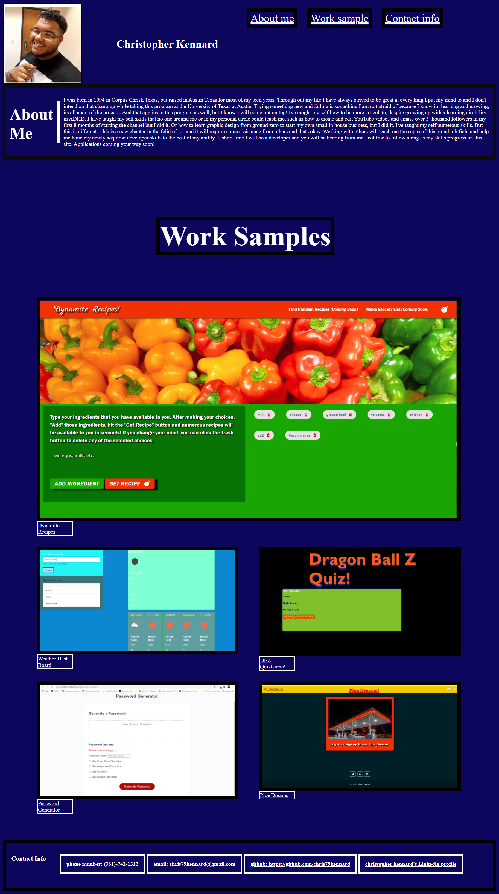

# Christopher Kennard's 2st home work assignment

## Task: Build A portfolio of work to showcase my skills and talents to employers looking to fill a part-time or full-time position

## Languages / Systems used to complete this assignment

1. Html
2. CSS
3. Git

### Portfolio Build to:

- Attract potential employers
- Show case my current skills
- To build appon as my skills progress.
- To complete home work assignment 2.

# screen shot

# links

- [deployed website Portfolio](https://chris79kennard.github.io/portfolio/)
- [Weather Dash Board](https://chris79kennard.github.io/Weather-Dash-Board-/)
- [Dragon Ball Z Quiz Game](https://chris79kennard.github.io/Code-Quiz/)
- [Pipe Dreams Full Stack API](https://pipe-dreams.herokuapp.com/)
- [Dynamite Recipes API](https://damienluzzo33.github.io/Project-1/)
- [Password Generator](https://chris79kennard.github.io/Password-Generator/)
- [Repository](https://github.com/chris79kennard/portfolio)
