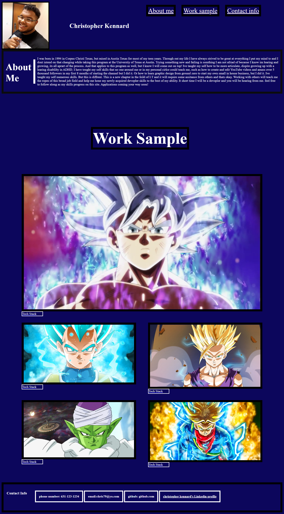

# Christopher Kennard's 2st home work assignment

## Task: Build A portfolio of work to showcase my skills and talents to employers looking to fill a part-time or full-time position

## Languages / Systems used to complete this assignment

1. Html
2. CSS
3. Git

### Portfolio Build to:

-Attract potential employers
-Show case my current skills
-To build appon as my skills progress.
-To complete home work assignment 2.

# screen shot

# links

- [deployed website](https://chris79kennard.github.io/portfolio/)
- [repository](https://github.com/chris79kennard/portfolio)
